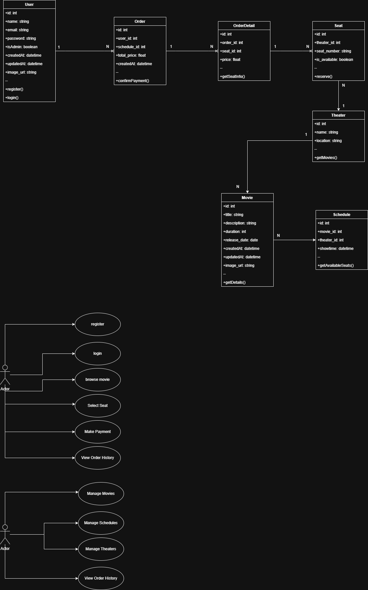
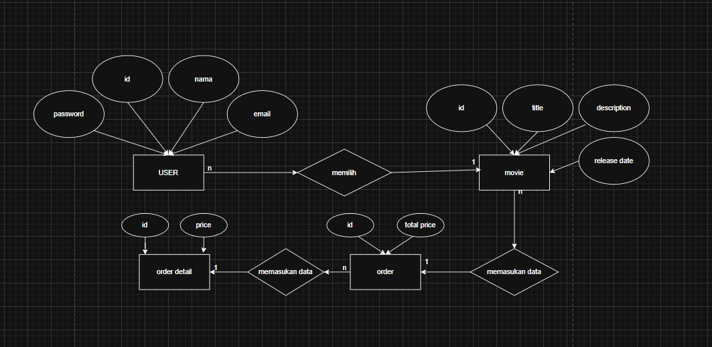
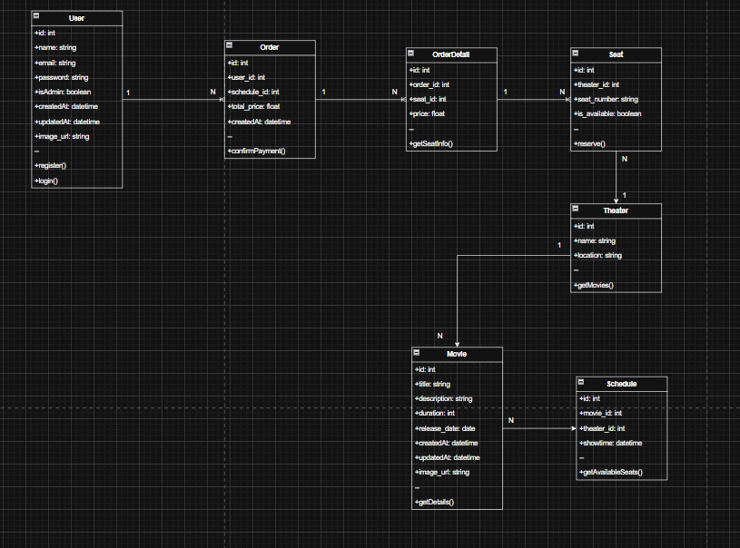
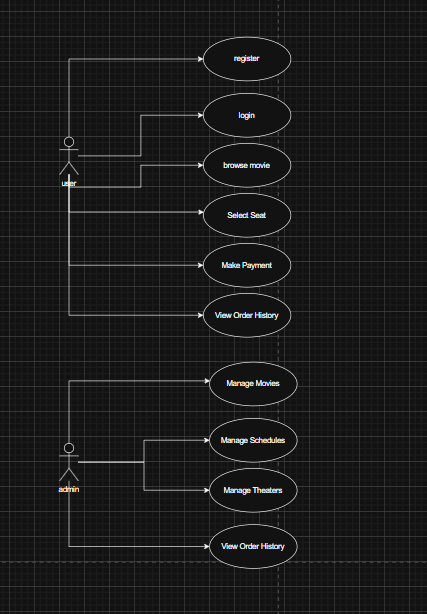
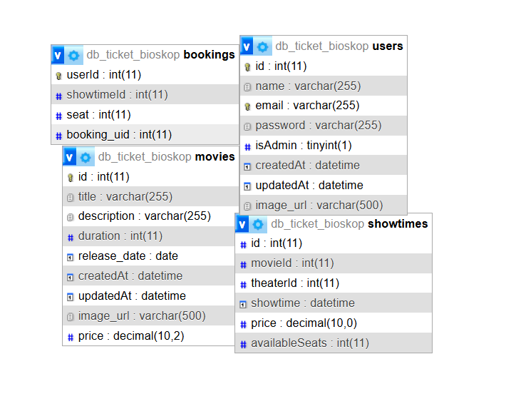

# CASE PROJECT : sistem ticketing bioskop 🎞️

Deskripsi:  Sistem ini memungkinkan pengguna untuk memesan tiket dari berbagai film yang ada di list film. Pengguna dapat memesan tiket film yang mereka ingin dilihat. Pemilik sistem dapan menambahkan film, menghapus film, mengedit film

# DESKRIPSI CASE 

Dalam project ini terdapat beberapa entitas utama yang berhubungan satu sama lain:

## Hubungan Antar Tabel:
### 1. User : Pengguna yang memesan tiket film.
### 2. Order : Pesanan tiket film yang dibuat oleh pengguna.
### 3. OrderDetail : Detail Order
### 4. Seat : Tempat duduk yang akan di pilih user
### 5. Theater : Tempat bioskop yang akan menampilkan film
### 6. Movie : Film yang akan tayang
### 7. Schedule : Jadwal film yang akan tayang

## Dependecies / Teknologi yang digunakan 💻

1. npm init -y

    Perintah ini digunakan untuk secara otomatis menginisialisasi dan membuat file package.json

    bash
    npm init -y
    

2. express

    Express JS sebagai framework Node.js untuk mengelola request dan response HTTP

    bash
   npm i express
    

3. mysql

    package untuk melakukan koneksi ke database

    bash
    npm i mysql2
    

4. axios

    Axios untuk menghubungkan antara frontend dan backend
   
    bash
    npm i axios
    

6. sequelize

    Sebagai Orm yang dipakai

    bash
    npm i sequelize
    

7. nodemon

    jalankan dengan mengetikan perintah (nodemon namaFile)

    bash
    npm install nodemon
    

    Perintah ini akan menjalankan server secara terus menerus

    Aplikasi akan berjalan pada port yang ditentukan di file .env .

 
    

# UML

 

 

# ERD

 

# CLASS DIAGRAM

 

# USECASE

 

# RELATION TABLE

 

# MADE BY

Nama : Iaka Azkiano ...
 
Kelas : XII PPLG ...
 
Mapel : Produktif PPLG ...
 
Tugas : Full Stack ...

